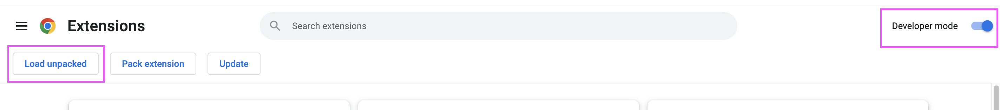
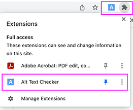

# alt-text-checker

## Contents  

This project consists of two parts - the browser extension and the web application.  
Please clone the entire repository [here](https://github.com/xiaozhen851/CS705-Group-Project) and follow the below directions to install the extension.
The web app is available live at <https://altit.netlify.app/> so there is no need to run the webpage locally.

---

## Adding the extension to your browser

- In your Google Chrome browser, select the puzzle piece icon to the right side of the URL bar.
- Select 'Manage Extensions' at the bottom of the drop-down list.
- Check that 'Developer Mode' in the top right corner is toggled ON.  
  
  
- Select 'Load unpacked' and choose the **'chrome extension'** folder.
- If successfully added, the extension should now appear in the list that opens when the puzzle piece icon is clicked, select 'Alt Text Checker' to open the pop-up.
- Optional: On the drop down extensions menu, you can select the push pin icon to keep the Alt It extension in your toolbar.  
  
   

---

## Using the extension

The application is still in the development stage, so we do not reccomend sending emails directly to websites yet. For this reason and due to technical constraints, we have not fully implemented the planned feature of automatically crawling a webpage to find website contact information.

**We suggest entering your own email address as the recipient so that you can see the contents of the email and test the functionality.**
  
### Notes about using the extension

- Please ensure the extension is installed before opening the webpage you wish to use it on.
- If the page was loaded prior to the extension installation, there will be an error shown in the console and no image count will be shown on the pop-up.
- The pop-up form does not allow input for pages with no valid images found.
- The bottom link on the pop-up *"Click here to edit more >"* will take you to the webpage version of the submission form with the fields prefilled from the pop-up.
